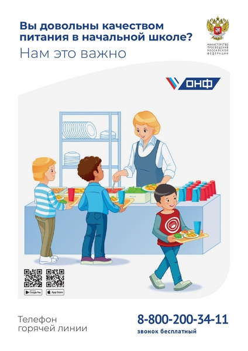

<!DOCTYPE html>
<html lang="en">
<head>
<title>Администрация муниципального образования Приморско-Ахтарского района</title>
<meta charset="utf-8">
<meta http-equiv="X-UA-Compatible" content="IE=edge">
<meta name="description" content="Invest project">
<meta name="viewport" content="width=device-width, initial-scale=1">
<link rel="stylesheet" type="text/css" href="styles/bootstrap4/bootstrap.min.css">
<link href="plugins/font-awesome-4.7.0/css/font-awesome.min.css" rel="stylesheet" type="text/css">
<link rel="stylesheet" type="text/css" href="plugins/OwlCarousel2-2.2.1/owl.carousel.css">
<link rel="stylesheet" type="text/css" href="plugins/OwlCarousel2-2.2.1/owl.theme.default.css">
<link rel="stylesheet" type="text/css" href="plugins/OwlCarousel2-2.2.1/animate.css">
<link rel="stylesheet" type="text/css" href="styles/main_styles.css">
<link rel="stylesheet" type="text/css" href="styles/responsive.css">
</head>
<body>

	
	<!-- Home -->

	

		

			
			<!-- Home Slider -->

			

				
				<!-- Slider Item -->
				

					

					

					
						
Управление образования администрации МО Приморско-Ахтарский район 

					
					

				

				<!-- Slider Item -->
				

					

					

						
					

				

				<!-- Slider Item -->
				

					

					

				
					

				

				<!-- Slider Item -->
				

					

			
					
					

				

			

			

			

			
		

		
		<!-- Header -->

		<header class="header">

			<!-- Top Bar -->
			

				

					

						

							

								

									

										
									

								

								

									

										<ul>
											
										</ul>
									

									

								
									

								

								

							
								

							

						

					

				
		
			

			<!-- Main Menu -->
			

				

					

						

							

								

									<ul class="main_menu_list">
										<li class="active hassubs">
											<a href="#">Главная
											
										<li><a href="about.html">Сведения
											<svg version="1.1" id="Layer_4" xmlns="http://www.w3.org/2000/svg" xmlns:xlink="http://www.w3.org/1999/xlink" x="0px" y="0px"
												 width="9px" height="5px" viewBox="0 0 9 5" enable-background="new 0 0 9 5" xml:space="preserve">
												<g>
													<polyline class="arrow_d" fill="none" stroke="#FFFFFF" stroke-miterlimit="10" points="0.022,-0.178 4.5,4.331 9.091,-0.275 	"/>
												</g>
											</svg>
										</a></li>
										<li class="hassubs">
											<a href="services.html">Документы
												<svg version="1.1" id="Layer_5" xmlns="http://www.w3.org/2000/svg" xmlns:xlink="http://www.w3.org/1999/xlink" x="0px" y="0px"
													 width="9px" height="5px" viewBox="0 0 9 5" enable-background="new 0 0 9 5" xml:space="preserve">
													<g>
														<polyline class="arrow_d" fill="none" stroke="#FFFFFF" stroke-miterlimit="10" points="0.022,-0.178 4.5,4.331 9.091,-0.275 	"/>
													</g>
												</svg>
											</a>
											<ul>
												<li><a href="#">Федеральные документы
													<svg version="1.1" id="Layer_6" xmlns="http://www.w3.org/2000/svg" xmlns:xlink="http://www.w3.org/1999/xlink" x="0px" y="0px"
														 width="9px" height="5px" viewBox="0 0 9 5" enable-background="new 0 0 9 5" xml:space="preserve">
														<g>
															<polyline class="arrow_d" fill="none" stroke="#FFFFFF" stroke-miterlimit="10" points="0.022,-0.178 4.5,4.331 9.091,-0.275 	"/>
														</g>
													</svg>
												</a></li>
												<li><a href="#">Региональные документы
													<svg version="1.1" id="Layer_7" xmlns="http://www.w3.org/2000/svg" xmlns:xlink="http://www.w3.org/1999/xlink" x="0px" y="0px"
														 width="9px" height="5px" viewBox="0 0 9 5" enable-background="new 0 0 9 5" xml:space="preserve">
														<g>
															<polyline class="arrow_d" fill="none" stroke="#FFFFFF" stroke-miterlimit="10" points="0.022,-0.178 4.5,4.331 9.091,-0.275 	"/>
														</g>
													</svg>
												</a></li>
												<li><a href="#">Муниципальные документы
													<svg version="1.1" id="Layer_8" xmlns="http://www.w3.org/2000/svg" xmlns:xlink="http://www.w3.org/1999/xlink" x="0px" y="0px"
														 width="9px" height="5px" viewBox="0 0 9 5" enable-background="new 0 0 9 5" xml:space="preserve">
														<g>
															<polyline class="arrow_d" fill="none" stroke="#FFFFFF" stroke-miterlimit="10" points="0.022,-0.178 4.5,4.331 9.091,-0.275 	"/>
														</g>
													</svg>
												</a></li>
											
													<svg version="1.1" id="Layer_9" xmlns="http://www.w3.org/2000/svg" xmlns:xlink="http://www.w3.org/1999/xlink" x="0px" y="0px"
														 width="9px" height="5px" viewBox="0 0 9 5" enable-background="new 0 0 9 5" xml:space="preserve">
														<g>
															<polyline class="arrow_d" fill="none" stroke="#FFFFFF" stroke-miterlimit="10" points="0.022,-0.178 4.5,4.331 9.091,-0.275 	"/>
														</g>
													</svg>
												</a></li>
											</ul>
										</li>
										<li class="hassubs">
											<a href="services.html">Регламенты
												<svg version="1.1" id="Layer_10" xmlns="http://www.w3.org/2000/svg" xmlns:xlink="http://www.w3.org/1999/xlink" x="0px" y="0px"
													 width="9px" height="5px" viewBox="0 0 9 5" enable-background="new 0 0 9 5" xml:space="preserve">
													<g>
														<polyline class="arrow_d" fill="none" stroke="#FFFFFF" stroke-miterlimit="10" points="0.022,-0.178 4.5,4.331 9.091,-0.275 	"/>
													</g>
												</svg>
											</a>
											<ul>
												
													<svg version="1.1" id="Layer_11" xmlns="http://www.w3.org/2000/svg" xmlns:xlink="http://www.w3.org/1999/xlink" x="0px" y="0px"
														 width="9px" height="5px" viewBox="0 0 9 5" enable-background="new 0 0 9 5" xml:space="preserve">
														<g>
															<polyline class="arrow_d" fill="none" stroke="#FFFFFF" stroke-miterlimit="10" points="0.022,-0.178 4.5,4.331 9.091,-0.275 	"/>
														</g>
													</svg>
												</a></li>
											
													<svg version="1.1" id="Layer_12" xmlns="http://www.w3.org/2000/svg" xmlns:xlink="http://www.w3.org/1999/xlink" x="0px" y="0px"
														 width="9px" height="5px" viewBox="0 0 9 5" enable-background="new 0 0 9 5" xml:space="preserve">
														<g>
															<polyline class="arrow_d" fill="none" stroke="#FFFFFF" stroke-miterlimit="10" points="0.022,-0.178 4.5,4.331 9.091,-0.275 	"/>
														</g>
													</svg>
												</a></li>
											
													<svg version="1.1" id="Layer_13" xmlns="http://www.w3.org/2000/svg" xmlns:xlink="http://www.w3.org/1999/xlink" x="0px" y="0px"
														 width="9px" height="5px" viewBox="0 0 9 5" enable-background="new 0 0 9 5" xml:space="preserve">
														<g>
															<polyline class="arrow_d" fill="none" stroke="#FFFFFF" stroke-miterlimit="10" points="0.022,-0.178 4.5,4.331 9.091,-0.275 	"/>
														</g>
													</svg>
												</a></li>
											
													<svg version="1.1" id="Layer_14" xmlns="http://www.w3.org/2000/svg" xmlns:xlink="http://www.w3.org/1999/xlink" x="0px" y="0px"
														 width="9px" height="5px" viewBox="0 0 9 5" enable-background="new 0 0 9 5" xml:space="preserve">
														<g>
															<polyline class="arrow_d" fill="none" stroke="#FFFFFF" stroke-miterlimit="10" points="0.022,-0.178 4.5,4.331 9.091,-0.275 	"/>
														</g>
													</svg>
												</a></li>
											</ul>
										</li>
										<li><a href="news.html">Новости
											<svg version="1.1" id="Layer_15" xmlns="http://www.w3.org/2000/svg" xmlns:xlink="http://www.w3.org/1999/xlink" x="0px" y="0px"
												 width="9px" height="5px" viewBox="0 0 9 5" enable-background="new 0 0 9 5" xml:space="preserve">
												<g>
													<polyline class="arrow_d" fill="none" stroke="#FFFFFF" stroke-miterlimit="10" points="0.022,-0.178 4.5,4.331 9.091,-0.275 	"/>
												</g>
											</svg>
										</a></li>
										
											</svg>
										</a></li>
									</ul>
								

								

									
тел: 8(86143)31629

									
e-mail:ahtrono@rambler.ru

									

										

											<svg xmlns="http://www.w3.org/2000/svg" xmlns:xlink="http://www.w3.org/1999/xlink" version="1.1" viewBox="0 0 512 512" enable-background="new 0 0 512 512" width="15px" height="15px">
												<g>
												<path class="mag_path" d="M495,466.2L377.2,348.4c29.2-35.6,46.8-81.2,46.8-130.9C424,103.5,331.5,11,217.5,11C103.4,11,11,103.5,11,217.5   S103.4,424,217.5,424c49.7,0,95.2-17.5,130.8-46.7L466.1,495c8,8,20.9,8,28.9,0C503,487.1,503,474.1,495,466.2z M217.5,382.9   C126.2,382.9,52,308.7,52,217.5S126.2,52,217.5,52C308.7,52,383,126.3,383,217.5S308.7,382.9,217.5,382.9z" fill="#f4f4f8"/>
												</g>
											</svg>
										

										

											<form action="#">
												<input class="search_input" type="search" placeholder="Keyword" required="required">
											</form>
										

									

								

							

						

					

				

			

			<!-- Menu -->

			

				

					

						

							

								

									
								

							

						

					

						
				

				<ul class="menu_list">
					<li class="menu_item">
						

							

								

									<a href="#">Главная</a>
								

							

						

					</li>
					<li class="menu_item">
						

							

								

								
								

							

						

					</li>
					<li class="menu_item">
						

							

								

							
								

							

						

					</li>
					<li class="menu_item">
						

							

								

							
								

							

						

					</li>
					<li class="menu_item">
						

							

								

									
								

							

						

					</li>
					<li class="menu_item">
						

							

								

								
								

							

						

					</li>
				</ul>
			

		</header>
	

	
	<!-- Intro -->

	

		

			

				

					

				

				

					

						

						
							<h1 class="intro_title">Управление образования администрации муниципального образования Приморско-Ахтарский район</h1>
						

						

							
Управлению образования администрации муниципального образования Приморско-Ахтарский район подведомственны 40 муниципальных учреждений, из них:

18 общеобразовательных школ;
17 дошкольных образовательных учреждений;
3 учреждения дополнительного образования детей;
Муниципальное казенное учреждение "Центр поддержки образования"
Муниципальное казенное учреждение "Централизованная бухгалтерия учреждений образованияПриморско-Ахтарского района "

						

						
					

				

			

		

	

	<!-- Services -->

	

		

			

				

					<!-- Testimonials Slider -->

					

						

							<!-- Services Item -->
							

								

									

									

								
									
В целях предотвращения распространения новой коронавирусной инфекции (COVID-19), а также в период действия режима «повышенной готовности» работа общеобразовательных организаций будет осуществляться на основании Санитарно-эпидемиологических правил СП 3.1/2.4.3598-20 «Санитарно-эпидемиологические требования к устройству, содержанию и организации работы образовательных организаций и других объектов социальной инфраструктуры для детей и молодежи в условиях распространения новой коронавирусной инфекции (COVID-19)», утвержденных постановлением главного государственного санитарного врача Российской Федерации от 30 июня 2020 г. № 16 (далее – СП 3.1/2.4.3598-20). В условиях распространения COVID – 19
СП 3.1/2.4.3598-20 применяются в дополнение к обязательным требованиям, установленным для образовательных организаций государственными санитарно-эпидемиологическими правилами и гигиеническими нормативами.
1 сентября 2020 года во всех общеобразовательных организациях района будут организованы и проведены праздничные мероприятия для учащихся 1, 9, 11 классов, на открытом воздухе с использованием средств индивидуальной защиты (маски) родителями (законными представителями).

									
									
								

							

							<!-- Services Item -->
							

								

									

									

							
									
Организация учебного процесса будет осуществляться по специально разработанному расписанию уроков, вход в здание школы будет осуществляться в несколько потоков по специально разработанному графику, с соблюдением требований антитеррористической безопасности;
Расписание уроков и график расписания звонков для каждого класса размещены на сайтах ОО;

							
								

							

							<!-- Services Item -->
							

								

									

									

							
									
1.3.За каждым классом закрепляется отдельный учебный кабинет (проветривание коридоров во время уроков, кабинетов - во время перемен).
1.4. Массовые мероприятияс участием разных классов отменяются.
1.5. При организации подвоза детей к месту учебы будет обеспечена дезинфекция всех поверхностей салона транспортного средства, осмотр водителей перед каждым рейсом с проведением термометрии, использование водителем средств индивидуальной защиты, перчаток.Родителям (законным представителям) необходимо осуществлять первичный контроль здоровья обучающихся, наличие средств индивидуальной защиты при посадке в автобус.
Ношение средств индивидуальной защиты сопровождающим обязательно.
1.6. На входах в общеобразовательную организацию для всех сотрудников и обучающихся будет осуществляться термометрия с использованием бесконтактных термометров.  Данные об изолированных обучающихся и сотрудниках с признаками инфекционных заболеваний будут вноситься в журнал регистрации термометрических показаний;
1.7. Лица с признаками инфекционных заболеваний (повышенной температурой тела 37,1) в школу допускаться не будут.
1.8. Посещение ОО детьми, перенесшими заболевание, и (или) в случае, если ребенок был в контакте с больным COVID-19, допускается при наличии медицинского заключения врача об отсутствии медицинских противопоказаний для пребывания в организации.

								
								

							

							<!-- Services Item -->
							

								

									

									

								
									
2. В соответствии с требованиями Роспотребнадзора (Постановление главного государственного санитарного врача Российской Федерации от 30.06.2020 года №16) ОО обязаны обеспечить требования, направленные на обеспечение безопасных условий деятельности образовательных организаций в условиях распространений новой коронавирусной инфекции: 
2.1. Уборка всех помещений с применением моющих и дезинфицирующих средств непосредственно перед началом функционирования организации
2.2. Обеспечение условий для гигиенической обработки рук с применением кожных антисептиков при входе в организацию, помещения для приема пищи, санитарные узлы и туалетные комнаты
2.3. Ежедневная влажная уборка помещений с применением дезинфицирующих средств с обработкой всех контактных поверхностей;
2.4. Генеральная уборка не реже одного раза в неделю
2.5. Обеспечение постоянного наличия в санитарных узлах для детей и сотрудников мыла, а также кожных антисептиков для обработки рук
2.6. Регулярное обеззараживание воздуха с использованием оборудования по обеззараживанию воздуха и проветривание помещений в соответствии с графиком работы организационного процесса и режима работы
2.7. Организация и контроль за  работой сотрудников, участвующих в приготовлении и раздаче пищи, обслуживающего персонала с использованием средств индивидуальной защиты органов дыхания (одноразовых масок), а также перчаток
2.8. Мытье посуды и столовых приборов в посудомоечных машинах при максимальных температурных режимах.

							
								

							

							<!-- Services Item -->
							

								

									

									

								
								

							

							<!-- Services Item -->
							

								

									

									

								
								

							

						

						
						

						

					

				

			

		

	

	<!-- Converter -->

	

		

		

			

				

					

						

							
							<h1 class="converter_title">Уважаемые родители (законные представители)!
     В соответствии с решением заседания оперативного штаба Краснодарского края c 29 июня 2020 года дошкольные образовательные организации муниципального образования Приморско-Ахтарский район начинают свою работу в условиях сохранения рисков распространения COVID-19.
     Для посещения ребёнком детского сада Вам необходимо получить справки из поликлиники о состоянии здоровья ребёнка и об эпидокружении.</h1>
						

						

		
							</select>
						</form>
					

				

	<!-- Info --

	<!-- News -->

	

		

			

				

					

					
					

				

			

			

				
				<!-- News Item -->
				

					

						

							
						

						

							
				

				<!-- News Item -->
				

					

						

							
						

						

							
					

				

				<!-- News Item -->
				

					

						

							
						

						

						
					

				

			

		

	

	

</body>
</html>
